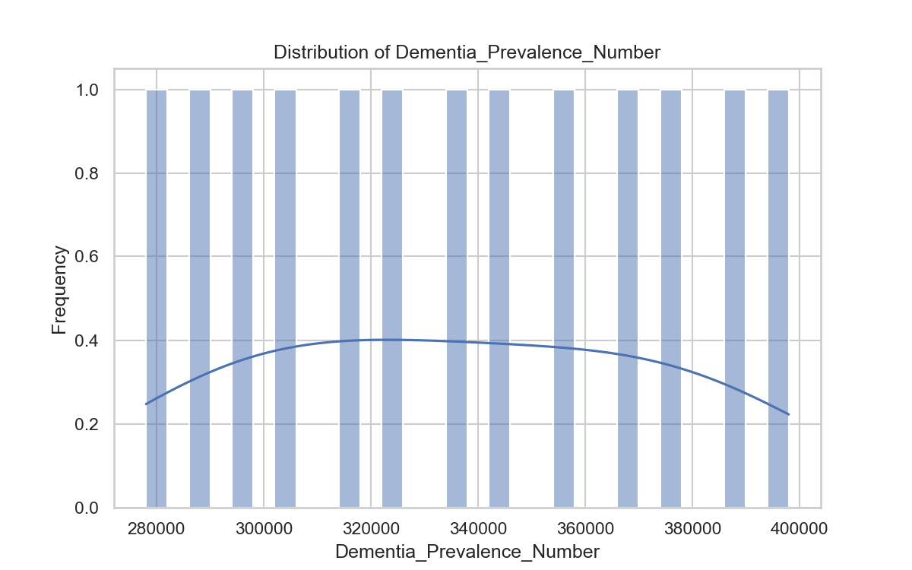
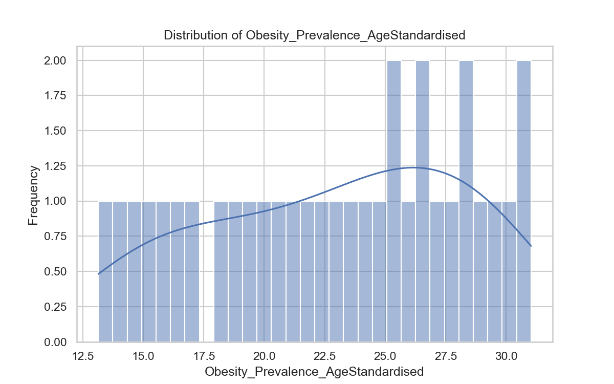
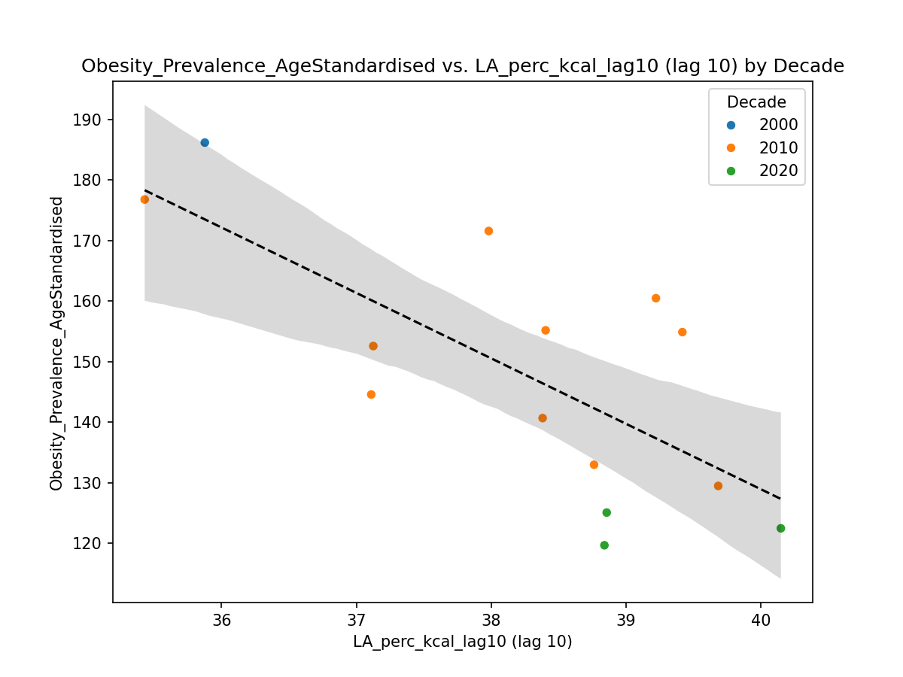

# Visualisation Figures Overview

This file provides a summary of each figure, a snippet of the input data, and a link to the PNG.

## correlation_heatmap.png

**Description:** Correlation heatmap of all numeric variables.

**Data snippet:**

|   Year |   Total_LA_Intake_g_per_capita_day |   LA_Intake_percent_calories |   Plant_Fat_Ratio |   Total_Calorie_Supply |   Total_Fat_Supply_g |   Total_Carb_Supply_g |   Total_Protein_Supply_g |   Population |   Diabetes_Prevalence_Rate_AgeStandardised |   Diabetes_Treatment_Rate_AgeStandardised |   Obesity_Prevalence_AgeStandardised |   BMI_AgeStandardised |   Total_Cholesterol_AgeStandardised |   NonHDL_Cholesterol_AgeStandardised |   Dementia_Prevalence_Number |   Dementia_Mortality_Rate_ASMR |   CVD_Mortality_Rate_ASMR |   LA_perc_kcal_lag5 |   LA_perc_kcal_lag10 |   LA_perc_kcal_lag15 |   LA_perc_kcal_lag20 |
|-------:|-----------------------------------:|-----------------------------:|------------------:|-----------------------:|---------------------:|----------------------:|-------------------------:|-------------:|-------------------------------------------:|------------------------------------------:|-------------------------------------:|----------------------:|------------------------------------:|-------------------------------------:|-----------------------------:|-------------------------------:|--------------------------:|--------------------:|---------------------:|---------------------:|---------------------:|
|   1961 |                            91.9745 |                      29.8373 |          0.134339 |                2774.28 |               100.12 |               387.66  |                    80.64 |          nan |                                        nan |                                       nan |                                  nan |                   nan |                                 nan |                                  nan |                          nan |                            nan |                       nan |                 nan |                  nan |                  nan |                  nan |
|   1962 |                            92.0002 |                      29.5761 |          0.127143 |                2799.56 |               100.91 |               389.062 |                    83.78 |          nan |                                        nan |                                       nan |                                  nan |                   nan |                                 nan |                                  nan |                          nan |                            nan |                       nan |                 nan |                  nan |                  nan |                  nan |
|   1963 |                            94.0119 |                      29.4399 |          0.160319 |                2874.02 |               102.67 |               402.188 |                    85.31 |          nan |                                        nan |                                       nan |                                  nan |                   nan |                                 nan |                                  nan |                          nan |                            nan |                       nan |                 nan |                  nan |                  nan |                  nan |
|   1964 |                            94.6693 |                      29.8973 |          0.174843 |                2849.84 |               101.92 |               397.18  |                    85.96 |          nan |                                        nan |                                       nan |                                  nan |                   nan |                                 nan |                                  nan |                          nan |                            nan |                       nan |                 nan |                  nan |                  nan |                  nan |
|   1965 |                            93.364  |                      30.0342 |          0.185565 |                2797.73 |               101.42 |               388.008 |                    83.23 |          nan |                                        nan |                                       nan |                                  nan |                   nan |                                 nan |                                  nan |                          nan |                            nan |                       nan |                 nan |                  nan |                  nan |                  nan |

## distribution_BMI_AgeStandardised.png

No mapping found for this figure.

## distribution_CVD_Mortality_Rate_ASMR.png

No mapping found for this figure.

## distribution_Dementia_Mortality_Rate_ASMR.png

No mapping found for this figure.

## distribution_Dementia_Prevalence_Number.png

No mapping found for this figure.

## distribution_Diabetes_Prevalence_Rate_AgeStandardised.png

No mapping found for this figure.

## distribution_Diabetes_Treatment_Rate_AgeStandardised.png

No mapping found for this figure.

## distribution_LA_Intake_percent_calories.png

No mapping found for this figure.

## distribution_LA_perc_kcal_lag10.png

No mapping found for this figure.

## distribution_LA_perc_kcal_lag15.png

No mapping found for this figure.

## distribution_LA_perc_kcal_lag20.png

No mapping found for this figure.

## distribution_LA_perc_kcal_lag5.png

No mapping found for this figure.

## distribution_NonHDL_Cholesterol_AgeStandardised.png

No mapping found for this figure.

## distribution_Obesity_Prevalence_AgeStandardised.png

No mapping found for this figure.

## distribution_Plant_Fat_Ratio.png

No mapping found for this figure.

## distribution_Population.png

No mapping found for this figure.

## distribution_Total_Calorie_Supply.png

No mapping found for this figure.

## distribution_Total_Carb_Supply_g.png

No mapping found for this figure.

## distribution_Total_Cholesterol_AgeStandardised.png

No mapping found for this figure.

## distribution_Total_Fat_Supply_g.png

No mapping found for this figure.

## distribution_Total_LA_Intake_g_per_capita_day.png

No mapping found for this figure.

## distribution_Total_Protein_Supply_g.png

No mapping found for this figure.

## distribution_Year.png

No mapping found for this figure.

## la_intake_trends.png

**Description:** Trends in Linoleic Acid (LA) intake over time.

**Data snippet:**

|   Year |   Total_LA_Intake_g_per_capita_day |   LA_Intake_percent_calories |
|-------:|-----------------------------------:|-----------------------------:|
|   1961 |                            91.9745 |                      29.8373 |
|   1962 |                            92.0002 |                      29.5761 |
|   1963 |                            94.0119 |                      29.4399 |
|   1964 |                            94.6693 |                      29.8973 |
|   1965 |                            93.364  |                      30.0342 |

## lagged_scatter_Obesity_Prevalence_AgeStandardised_vs_LA_perc_kcal_lag10_by_decade.png

**Description:** Lagged scatter: Obesity Prevalence (Age-Standardised) vs LA % kcal (lag 10, by decade).

**Data snippet:**

|   Obesity_Prevalence_AgeStandardised |   LA_Intake_percent_calories |   Year |
|-------------------------------------:|-----------------------------:|-------:|
|                                  nan |                      29.8373 |   1961 |
|                                  nan |                      29.5761 |   1962 |
|                                  nan |                      29.4399 |   1963 |
|                                  nan |                      29.8973 |   1964 |
|                                  nan |                      30.0342 |   1965 |

## linear_regression_Total_LA_Intake_g_per_capita_day_on_Year.png

No mapping found for this figure.

## overlay_time_series.png

**Description:** Overlay of multiple time series variables.

**Data snippet:**

|   Year |   Total_LA_Intake_g_per_capita_day |   LA_Intake_percent_calories |   Plant_Fat_Ratio |   Total_Calorie_Supply |   Total_Fat_Supply_g |   Total_Carb_Supply_g |   Total_Protein_Supply_g |   Population |   Diabetes_Prevalence_Rate_AgeStandardised |   Diabetes_Treatment_Rate_AgeStandardised |   Obesity_Prevalence_AgeStandardised |   BMI_AgeStandardised |   Total_Cholesterol_AgeStandardised |   NonHDL_Cholesterol_AgeStandardised |   Dementia_Prevalence_Number |   Dementia_Mortality_Rate_ASMR |   CVD_Mortality_Rate_ASMR |   LA_perc_kcal_lag5 |   LA_perc_kcal_lag10 |   LA_perc_kcal_lag15 |   LA_perc_kcal_lag20 |
|-------:|-----------------------------------:|-----------------------------:|------------------:|-----------------------:|---------------------:|----------------------:|-------------------------:|-------------:|-------------------------------------------:|------------------------------------------:|-------------------------------------:|----------------------:|------------------------------------:|-------------------------------------:|-----------------------------:|-------------------------------:|--------------------------:|--------------------:|---------------------:|---------------------:|---------------------:|
|   1961 |                            91.9745 |                      29.8373 |          0.134339 |                2774.28 |               100.12 |               387.66  |                    80.64 |          nan |                                        nan |                                       nan |                                  nan |                   nan |                                 nan |                                  nan |                          nan |                            nan |                       nan |                 nan |                  nan |                  nan |                  nan |
|   1962 |                            92.0002 |                      29.5761 |          0.127143 |                2799.56 |               100.91 |               389.062 |                    83.78 |          nan |                                        nan |                                       nan |                                  nan |                   nan |                                 nan |                                  nan |                          nan |                            nan |                       nan |                 nan |                  nan |                  nan |                  nan |
|   1963 |                            94.0119 |                      29.4399 |          0.160319 |                2874.02 |               102.67 |               402.188 |                    85.31 |          nan |                                        nan |                                       nan |                                  nan |                   nan |                                 nan |                                  nan |                          nan |                            nan |                       nan |                 nan |                  nan |                  nan |                  nan |
|   1964 |                            94.6693 |                      29.8973 |          0.174843 |                2849.84 |               101.92 |               397.18  |                    85.96 |          nan |                                        nan |                                       nan |                                  nan |                   nan |                                 nan |                                  nan |                          nan |                            nan |                       nan |                 nan |                  nan |                  nan |                  nan |
|   1965 |                            93.364  |                      30.0342 |          0.185565 |                2797.73 |               101.42 |               388.008 |                    83.23 |          nan |                                        nan |                                       nan |                                  nan |                   nan |                                 nan |                                  nan |                          nan |                            nan |                       nan |                 nan |                  nan |                  nan |                  nan |

## scatter_Year_vs_Total_LA_Intake_g_per_capita_day.png

No mapping found for this figure.

## time_series_BMI_AgeStandardised.png

No mapping found for this figure.

## time_series_CVD_Mortality_Rate_ASMR.png

No mapping found for this figure.

## time_series_Dementia_Mortality_Rate_ASMR.png

No mapping found for this figure.

## time_series_Dementia_Prevalence_Number.png

No mapping found for this figure.

## time_series_Diabetes_Prevalence_Rate_AgeStandardised.png

No mapping found for this figure.

## time_series_Diabetes_Treatment_Rate_AgeStandardised.png

No mapping found for this figure.

## time_series_LA_Intake_percent_calories.png

**Description:** Time series of LA intake as percent of calories.

**Data snippet:**

|   Year |   LA_Intake_percent_calories |
|-------:|-----------------------------:|
|   1961 |                      29.8373 |
|   1962 |                      29.5761 |
|   1963 |                      29.4399 |
|   1964 |                      29.8973 |
|   1965 |                      30.0342 |

## time_series_LA_Intake_percent_calories_annotated.png

**Description:** Annotated time series of LA intake as percent of calories.

**Data snippet:**

|   Year |   LA_Intake_percent_calories |
|-------:|-----------------------------:|
|   1961 |                      29.8373 |
|   1962 |                      29.5761 |
|   1963 |                      29.4399 |
|   1964 |                      29.8973 |
|   1965 |                      30.0342 |

## time_series_LA_perc_kcal_lag10.png

No mapping found for this figure.

## time_series_LA_perc_kcal_lag15.png

No mapping found for this figure.

## time_series_LA_perc_kcal_lag20.png

No mapping found for this figure.

## time_series_LA_perc_kcal_lag5.png

No mapping found for this figure.

## time_series_NonHDL_Cholesterol_AgeStandardised.png

No mapping found for this figure.

## time_series_Obesity_Prevalence_AgeStandardised.png

No mapping found for this figure.

## time_series_Plant_Fat_Ratio.png

**Description:** Time series of plant fat ratio.

**Data snippet:**

|   Year |   Plant_Fat_Ratio |
|-------:|------------------:|
|   1961 |          0.134339 |
|   1962 |          0.127143 |
|   1963 |          0.160319 |
|   1964 |          0.174843 |
|   1965 |          0.185565 |

## time_series_Population.png

No mapping found for this figure.

## time_series_Total_Calorie_Supply.png

**Description:** Time series of total calorie supply.

**Data snippet:**

|   Year |   Total_Calorie_Supply |
|-------:|-----------------------:|
|   1961 |                2774.28 |
|   1962 |                2799.56 |
|   1963 |                2874.02 |
|   1964 |                2849.84 |
|   1965 |                2797.73 |

## time_series_Total_Carb_Supply_g.png

No mapping found for this figure.

## time_series_Total_Cholesterol_AgeStandardised.png

No mapping found for this figure.

## time_series_Total_Fat_Supply_g.png

**Description:** Time series of total fat supply (g).

**Data snippet:**

|   Year |   Total_Fat_Supply_g |
|-------:|---------------------:|
|   1961 |               100.12 |
|   1962 |               100.91 |
|   1963 |               102.67 |
|   1964 |               101.92 |
|   1965 |               101.42 |

## time_series_Total_LA_Intake_g_per_capita_day.png

No mapping found for this figure.

## time_series_Total_Protein_Supply_g.png

No mapping found for this figure.

## time_series_Year.png

No mapping found for this figure.

